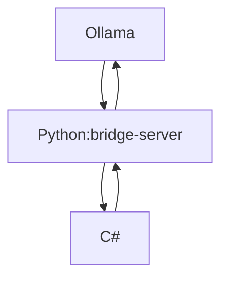

# Architecture

## Structure

- /docs - documentation files

- /src/OllamaInteract.PythonServer - bridge server for Ollama handling and file processing
    + /services - services that the bridge provides
    + /api - the api logic that C# Core interacts with through HTTP
- /src/OllamaInteract.Core - the core C# <-> python communcation services for C#
    + /Models - template classes for type safety
    + /Services - the services that the sub-library provides for further C# CLI and GUI
- /src/OllamaInteract.CLI - the CLI
- /src/OllamaInteract.GUI - [avalonia](https://github.com/AvaloniaUI/Avalonia) GUI app

## Flow

